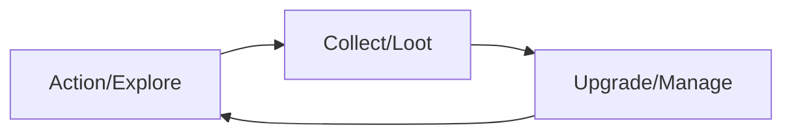
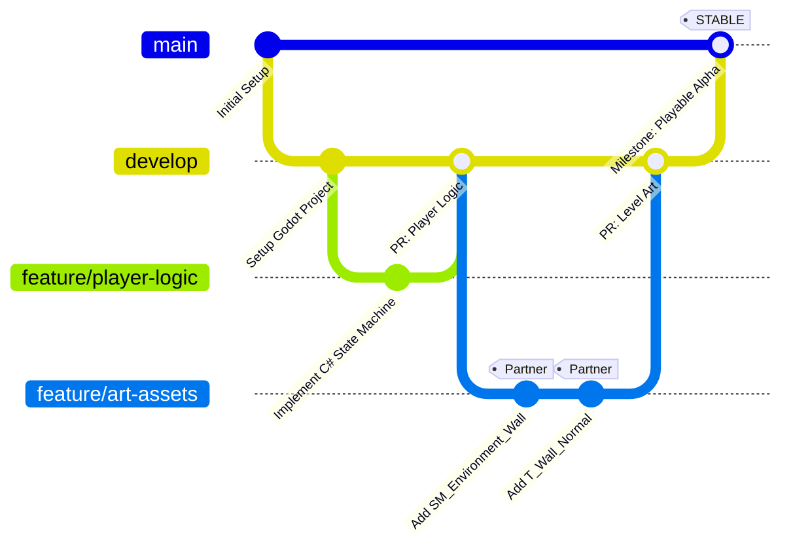
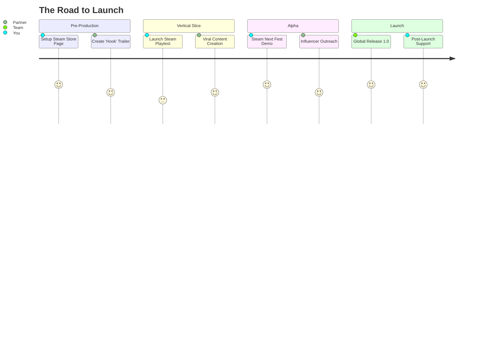

# Game Design Document: [Project Name]

## 1. Project Identity: The "North Star"

* **High Concept:** [A one-sentence summary of the game.]
* **Genre:** [Primary Genre] / [Secondary Genre]
* **Core Pillars:** (Three non-negotiable rules that guide design)
1. [Pillar 1: e.g., High-Stakes Resource Management]
2. [Pillar 2: e.g., Tactile Physics Interaction]
3. [Pillar 3: e.g., Atmospheric Storytelling]


* **Target Platform:** PC / Steam Deck (Primary focus for performance optimization).
* **Target Audience:** [e.g., Fans of 'Factorio' and 'Hardspace: Shipbreaker']

---

## 2. Gameplay Mechanics & Systems

### 2.1 The Core Loop

[Describe the 30-second loop the player repeats.]



### 2.2 Control Schema

* **Input Map:** [Keyboard/Mouse vs. Gamepad mapping.]
* **Game Feel:** [Constants for acceleration, friction, and "juice."]

### 2.3 System Logic (The "Math")

> **Example Damage Formula:**
> 
> $$FinalDamage = \max(0, (BaseDamage \times \text{CritMultiplier}) - \text{TargetArmor})$$
> 
> 

---

## 3. Creative & Narrative (Partner's Domain)

### 3.1 Art Direction

* **Visual Style:** [e.g., Low-poly, Stylized PBR, 2D Pixel Art]
* **Color Palette:** [Primary, Secondary, and Accent colors]
* **Lighting Mood:** [e.g., High-contrast, Noir, Vibrant]

### 3.2 Narrative & World-Building

* **The Setting:** [Where and when the game takes place]
* **The Conflict:** [What is the player's primary motivation?]

---

## 4. Technical Architecture (Technical Director's Domain)

### 4.1 Tech Stack

* **Engine:** **Godot 4.6+** (Subject to change based on project needs).
* **Scripting:** **C#** (for core systems/SaMD-level rigor) and/or **GDScript** (for rapid gameplay iteration).
* **External Libraries:** [e.g., FMOD for audio, GodotSteeringAI, etc.]

### 4.2 Class Hierarchy & Architecture

* **Design Patterns:** Singleton (for Global Managers), Observer (for UI/Events), and State Machines (for AI/Player states).
* **Data Handling:** Use `.tres` (Custom Resources) for item data and stats to allow the Artist to tweak values without touching code.
* **Node Structure:** Favor Scene Composition. Avoid deeply nested inheritance; use child nodes for specialized behaviors (e.g., `HealthNode`, `InteractableNode`).

### 4.3 Coding Standards & Conventions

#### A. Naming Conventions (Code)

| Entity | Convention | Example |
| --- | --- | --- |
| **Classes / Scripts** | PascalCase | `PlayerController.cs`, `InventoryItem.gd` |
| **Methods / Functions** | PascalCase (C#) / snake_case (GD) | `CalculateDamage()` / `_calculate_damage()` |
| **Private Fields** | camelCase with underscore | `_currentHealth` / `_current_health` |
| **Public Variables** | PascalCase / snake_case | `MaxHealth` / `max_health` |
| **Constants / Enums** | SCREAMING_SNAKE | `MAX_PLAYERS`, `STATE_IDLE` |

#### B. Engineering Principles

* **Memory Management:** Minimize object instantiation in `_Process()` or `_PhysicsProcess()`. Use Object Pooling for projectiles and VFX.
* **Type Safety:** Always use static typing in GDScript (`var x: int = 5`) or C# to prevent runtime errors.
* **Signals/Events:** Use Godot Signals for communication between nodes to ensure decoupled architecture (Downwards = Calls, Upwards = Signals).

---

## 5. The "Handshake" (Asset & File Pipeline)

### 5.1 Naming Structure Patterns (Files)

**Pattern:** `Prefix_Subtype_Name_Index`

| Asset Category | Prefix | Example |
| --- | --- | --- |
| **3D Mesh** | `SM_` (Static), `SK_` (Skeletal) | `SM_Prop_Chair_01.glb` |
| **Texture** | `T_` (Base), `T_N_` (Normal) | `T_Hero_BaseColor_01.png` |
| **Material** | `M_` | `M_Metal_Rusty_02.tres` |
| **Animation** | `A_` | `A_Hero_Run.res` |
| **Scene/Prefab** | `SCN_` | `SCN_Enemy_Grunt.tscn` |
| **Audio** | `SFX_` / `MSC_` | `SFX_UI_Click_01.wav` |

### 5.2 Folder Structure

```text
/root
  /assets (Partner's Workspace)
    /models
    /textures
    /audio
  /src (Your Workspace)
    /core
    /nodes
    /resources
  /scenes (The Combined Result)
    /levels
    /prefabs
  /settings (Input maps, Godot project files)

```

---

## 6. Infrastructure & DevOps

### 6.1 Version Control (VCS) & Workflow

* **Tool:** Git + LFS (Large File Storage).
* **Workflow:** Feature Branch model. `main` is always stable.



### 6.1.1 Conventional Commits

All commit messages **must** follow the [Conventional Commits](https://www.conventionalcommits.org/) specification to enable automated changelogs and semantic versioning.

**Format:** `<type>(<scope>): <short description>`

| Type | When to Use | Example |
| --- | --- | --- |
| `feat` | A new gameplay feature or system | `feat(player): add double-jump mechanic` |
| `fix` | A bug fix | `fix(inventory): correct item stack overflow` |
| `art` | New or updated art assets | `art(environment): add SM_Prop_Barrel_01.glb` |
| `audio` | New or updated audio assets | `audio(sfx): add SFX_Player_Jump_01.wav` |
| `perf` | A code change that improves performance | `perf(rendering): reduce draw calls in cave level` |
| `refactor` | Code change that is not a fix or feature | `refactor(enemy-ai): extract state machine to base class` |
| `docs` | Documentation changes (GDD, README, etc.) | `docs(gdd): update milestone targets` |
| `ci` | CI/CD and build script changes | `ci: add Steam Deck export target to workflow` |
| `chore` | Tooling, config, or dependency updates | `chore: upgrade Godot version to 4.6` |

> **Rules:**
> - Use the **imperative, present tense** in descriptions: *"add"*, not *"added"* or *"adds"*.
> - Keep the short description under **72 characters**.
> - Reference issue/ticket numbers in the footer: `Closes #42`.
> - **Breaking changes** must append a `!` after the type and include a `BREAKING CHANGE:` footer.
>
> **Breaking Change Example:**
> ```
> feat(save-system)!: migrate save format to v2
>
> BREAKING CHANGE: Old db.txt save files are not compatible with the new schema.
> ```


### 6.2 CI/CD Pipeline

* **Automated Export:** Use GitHub Actions to export `.pck` and `.exe` for Windows/Linux on every merge to `develop`.
* **Asset Validation:** A `pre-commit` hook (Python) enforces the naming conventions in Section 5.1.
* **Performance Testing:** Automated "headless" run to log frame times and memory usage.

---

## 7. Project Management & Milestones

### 7.1 Development Phases

1. **Prototype:** Mechanics validation (Greybox).
2. **Vertical Slice:** One polished 5-minute loop (Full Art/Tech).
3. **Alpha:** Feature complete (All systems implemented).
4. **Beta:** Content complete (Polish, bug fixing, Steam Deck optimization).

### 7.2 Risk Assessment

| Risk | Impact | Mitigation |
| --- | --- | --- |
| **Scope Creep** | High | Feature freeze at Alpha. No new mechanics after Prototype validation. |
| **Engine Change** | Medium | Keep core logic in pure C# classes where possible, abstracted from Godot APIs. |
| **Performance** | High | Weekly profiling on target hardware (Steam Deck). |

---

## 8. Marketing & Community Strategy

### 8.1 The "Wishlist" Acquisition Funnel

In the Steam ecosystem, **Wishlists** are the primary predictor of launch success. The goal is to reach specific thresholds to trigger the Steam recommendation algorithm.

| Milestone | Target Wishlists | Steam Algorithm Impact |
| --- | --- | --- |
| **Warm-up** | 1,000 – 5,000 | Visibility in "Popular Upcoming" lists. |
| **Critical Mass** | 7,000 – 12,000 | High probability of "Discovery Queue" placement. |
| **Safe Launch** | 20,000+ | Front-page "New and Trending" placement on launch day. |

### 8.2 Marketing Assets Pipeline

Marketing assets must be treated with the same version-control rigor as game assets.

* **Steam Capsules:** 5+ variations (Header, Small, Main, Vertical, Hero).
* **Gameplay Trailer:** A 60-second "hook" video showing gameplay within the first 5 seconds.
* **Technical Devlogs:** Monthly updates shared via Steam/YouTube to demonstrate project health.
* **Localization:** Support for EFIGS + CJK (English, French, Italian, German, Spanish, Chinese, Japanese, Korean) to multiply the potential player base.

### 8.3 Technical & Performance Marketing

Leverage technical strengths as a unique selling proposition (USP):

* **"Steam Deck Verified" Campaign:** Market specifically to the handheld community with performance benchmarks.
* **Steam Playtest:** Use the Steamworks Playtest feature to invite community members into the CI/CD loop for feedback and QA.
* **Optimization Transparency:** Share "Low-Spec" compatibility and frame-time stability reports to build trust.

### 8.4 Role Split (The Duo)

* **Technical Director (You):** Steamworks backend management, Store Page SEO/Tags, Localization system implementation, and Technical Demo stability.
* **Creative Director (Partner):** Visual branding, Social Media content (TikTok/Reels), Community management (Discord), and Trailer production.

### 8.5 Steam Engagement & Retention

Post-launch retention is driven by Steamworks engagement features. These must be designed alongside gameplay, not bolted on at ship.

#### A. Steam Achievements

Achievements serve a dual purpose: **replayability driver** and **free marketing** (unlock notifications appear in friends' feeds).

| Achievement Tier | Count | Design Goal |
| --- | --- | --- |
| **Story** | ~10 | One per major milestone; no player should miss these. |
| **Skill** | ~10 | Reward mastery (e.g., *"No-Hit a boss"*). |
| **Explorer** | ~10 | Reward thoroughness (e.g., *"Find all secrets in Level 2"*). |
| **Hidden** | ~5 | Reward curiosity; not visible until unlocked. |

> - Define all achievement `API_NAME` strings early — they are **permanent** and cannot be renamed after going live.
> - Use `SCREAMING_SNAKE_CASE` for API names: `ACH_BEAT_BOSS_01`.
> - Store unlock logic server-side via `ISteamUserStats::SetAchievement()` — never trust the client.

#### B. Steam Stats

Stats are the **data backbone** for achievements and for your own post-launch analytics.

| Stat | Type | Example Use |
| --- | --- | --- |
| `STAT_ENEMIES_KILLED` | `INT` | Gate a kill-count achievement |
| `STAT_DEATHS` | `INT` | Track difficulty curve for balancing |
| `STAT_DISTANCE_TRAVELED` | `FLOAT` | Explorer/completionist tracking |
| `STAT_PLAYTIME_SECONDS` | `INT` | Engagement reporting |

> - Stats and Achievements share the same `RequestCurrentStats()` / `StoreStats()` call cycle.
> - Define the full schema in the Steamworks App Admin panel **before** Beta; changes after launch can break existing unlock conditions.

#### C. Trading Cards, Badges & Booster Packs

Trading Cards are a **passive revenue and visibility** feature. Players craft badges from cards, which generates Steam Market activity that keeps the game surfaced in community feeds.

* **Card Set Size:** 5–15 cards. A set of **8** is the practical sweet spot.
* **Foil Cards:** 1 foil variant per card, automatically generated at the same time.
* **Badge Levels:** 5 levels (craft the full set 5× to reach max level) + 1 Foil Badge level.
* **Asset Requirements (per card):** One large artwork (`800×450 px`) and one card thumbnail (`184×267 px`); follow the Partner's art direction for visual consistency.
* **Booster Packs:** Automatically distributed by Steam to eligible players; no developer action required beyond card submission.

> **Role Split:**
> - **Creative Director:** Card artwork, badge artwork, emoticons, and profile backgrounds.
> - **Technical Director:** Steamworks App Admin submission, card drop configuration, and Stats/Achievement schema.

---

### 8.6 Marketing Roadmap


